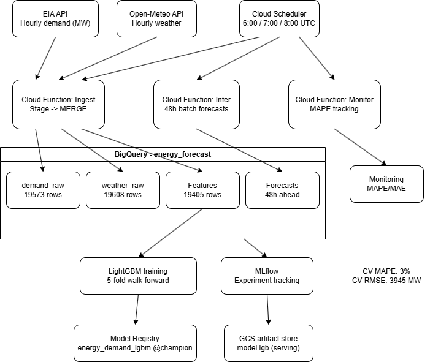

# Energy Demand Forecasting — End-to-End MLOps Pipeline on GCP

A production-style MLOps pipeline for hourly electricity demand forecasting across the PJM Mid-Atlantic grid, 48 hours ahead. Built on Google Cloud Platform with MLflow for experiment tracking and LightGBM for modelling.

This is the second project of a data science portfolio. The focus here is getting familiar with Google cloud services and engineering rigour: idempotent ingestion, proper time-series cross-validation, a model registry with champion tagging, and automated monitoring against live actuals.

---

## Architecture



| Layer | Component |
|---|---|
| Ingestion | Cloud Functions (`ingest`, `backfill`) + Cloud Scheduler |
| Storage | BigQuery (`demand_raw`, `weather_raw`, `features`, `forecasts`, `monitoring`) |
| Training | LightGBM + 5-fold walk-forward CV + MLflow |
| Model Registry | MLflow (`energy_demand_lgbm` v1, tagged `champion`) |
| Model Artifact Store | GCS (`mlflow/energy_demand_lgbm/champion/artifacts/`) |
| Serving | Cloud Function (`infer`) — batch, 48h horizon |
| Monitoring | Cloud Function (`monitor`) — daily MAPE/MAE/RMSE vs actuals |
| Orchestration | Cloud Scheduler — 3 jobs, fully automated |

---

## Problem

PJM operates one of the largest electricity grids in the world, covering 13 US states and Washington DC. Accurate demand forecasting 24–72 hours ahead is critical for grid balancing, dispatch planning, and energy trading. Even a 1% improvement in MAPE at this scale translates to meaningful operational and financial impact.

---

## Data

**Demand:** EIA Open Data API — hourly demand in MW for the PJM region, from 2024-01-01 to present (~19,500 rows).

**Weather:** Open-Meteo API — hourly weather at a representative PJM centroid (Philadelphia area), including temperature, windspeed, cloud cover, and relative humidity.

Both sources are fetched daily, staged, and merged into BigQuery using an idempotent MERGE strategy to prevent duplicates on re-runs.

---

## Features

Engineered in BigQuery from the raw tables:

| Feature | Description |
|---|---|
| `hour_of_day` | 0–23, captures intraday demand shape |
| `day_of_week` | 0–6, captures weekday/weekend patterns |
| `month` | 1–12, captures seasonal patterns |
| `is_weekend` | Binary flag |
| `temperature_c` | Primary weather driver of demand |
| `windspeed_ms` | Secondary weather feature |
| `cloudcover_pct` | Secondary weather feature |
| `relative_humidity` | Secondary weather feature |
| `demand_lag_24h` | Same hour yesterday — strongest predictor |
| `demand_lag_48h` | Same hour two days ago |
| `demand_lag_168h` | Same hour last week — captures weekly seasonality |

---

## Model

**Algorithm:** LightGBM gradient boosted trees.

**Cross-validation:** 5-fold walk-forward (expanding window). Random splits are never used — data is strictly ordered by time to prevent leakage. Each fold trains on all data up to a cutoff and validates on the subsequent block.

**Experiment tracking:** MLflow, running locally, logging parameters, metrics, and the model artifact per run.

**Registry:** Model registered as `energy_demand_lgbm`, version 1 tagged as `champion` in the MLflow model registry. The serving layer loads the `champion` artifact from GCS, decoupling deployment from the tracking server.

---

## Results

| Metric | CV (walk-forward) | Live (vs actuals) |
|---|---|---|
| MAPE | 3.00% | 1.20% |
| MAE | — | 1,019 MW |
| RMSE | 3,945 MW | 1,264 MW |

**CV MAPE of 3.00%** is within the 2–4% range typical of industry-grade day-ahead forecasting models for large grids.

**Live MAPE of 1.20%** over 42 matched hours shows the model generalising well to unseen data — no sign of overfitting. The gap between CV and live performance is partly explained by the CV estimate being conservative by design (walk-forward folds include early training data with fewer lag features available).

**Feature importances** (LightGBM gain) confirm physically sensible learning: `demand_lag_24h` dominates by an order of magnitude, followed by `demand_lag_48h`, `temperature_c`, and `demand_lag_168h`. The model has correctly identified that yesterday-same-hour is the strongest predictor of current demand, with weather and weekly seasonality as meaningful secondary signals.

---

## Daily Pipeline

Fully automated via Cloud Scheduler:
```
06:00 UTC — ingest    Fetch demand + weather, MERGE to BigQuery
07:00 UTC — infer     Load champion model, write 48h forecasts to BigQuery
08:00 UTC — monitor   Join forecasts vs actuals, compute MAPE/MAE/RMSE, flag drift
```

The monitoring function raises an alert flag if MAPE exceeds 6% — a signal that the model may need retraining or that data quality has degraded.

---

## Technical Decisions

**Idempotent ingestion.** The pipeline uses a stage-then-MERGE pattern in BigQuery rather than simple appends. Re-running the ingest function on any day produces identical results — no duplicate rows, no gaps.

**Walk-forward cross-validation.** Time-series data cannot be randomly split without leaking future information into training. All CV folds respect temporal ordering, making the 3.00% MAPE estimate a realistic lower bound on production error.

**Champion/challenger registry pattern.** The serving layer loads the model tagged `champion` from GCS rather than a hardcoded version. Promoting a new model to production requires only updating the alias — no redeployment of the inference function.

**Separation of tracking and serving.** MLflow handles experiment tracking and the registry during development. The final artifact is exported to GCS for serving, meaning the inference function has no runtime dependency on the MLflow server.

---

## What Would Come Next

- **Challenger model:** Train an alternative (e.g. XGBoost or a linear baseline) and route a traffic split to compare live MAPE before promoting to champion.
- **Retraining trigger:** Add a Cloud Function that automatically retrains when the monitoring table records MAPE above threshold for N consecutive days.
- **Alerting:** Route the alert flag to Cloud Monitoring or PagerDuty for operational visibility.
- **Extended features:** Holiday flags, rolling demand statistics, interaction terms between temperature and hour of day.
- **Probabilistic forecasts:** Replace point estimates with quantile regression or conformal prediction intervals — particularly relevant for grid operators who need to plan for worst-case demand, not just expected demand.

---

## Repository Structure
```
energy-forecast/
├── README.md
├── ingest_function/
│   └── main.py
│   └── requirements.txt         
├── training/
│   ├── train.py
├── serving/
│   ├── main.py          
│   └── requirements.txt
├── monitoring/
│   ├── main.py          
│   └── requirements.txt
└── assets/
    └── architecture.png  
```

---

## Stack

Python · LightGBM · MLflow · Google Cloud Functions · BigQuery · Google Cloud Storage · Cloud Scheduler · Open-Meteo API · EIA API